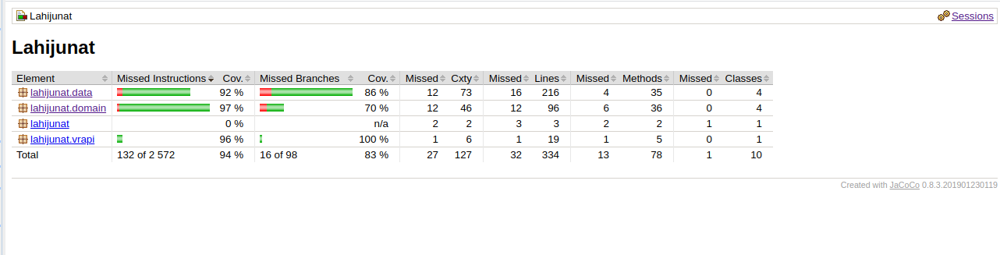

# Testausdokumentti

## Yksikkö- ja integraatiotestaus
Suurimmalle osalle luokkia on luotu yksikkötestit. Testit on jaettu kolmeen luokkaan pakkausten mukaan.

Osa testeistä hyödyntää json muotoista testidataa, joka on tallennettu src/test kansioon. Testidata on todellista Digitrafic rajapinnan dataa. Osa yksikkötesteistä vaatii internetyhteyden toimiakseen.

Käyttöliittymäkerrosta lukuunottamatta sovelluksen testauksen rivikattavuus on 94% ja haarautumakattavuus 83%

## Järjestelmätestaus
Sovellusta on testattu kahdessa ympäristössä: omalla tietokoneella (Kubuntu 19.10) sekä yliopiston cubli ympäristössä. 

Sovelluksen kaikki toiminnallisuudet on testattu manuaalisesti varsin perinpohjaisesti. Sovellukselle ei pysty syöttämään väärää tietoa tai saada sitä kaatumaan. Sovellusta on testattu hakemistossa, johon on ei ole kirjoitusoikeutta. Ohjelmaa on myös testattu tilanteissa, jossa tiedosto puuttuu.

Sovellusta ei ole ollenkaan testattu tilanteissa, jossa digitrafic -rajapinta antaa virheellistä tai normaalista poikkeavaa dataa. Ohjelma antaa käyttäjälleen tällöin todennäköisesti varsin kryptisiä virheilmoituksia.

Mikäli sovelluksen käynnistyessä sen työhakemistossa on korruptoitunut searches.csv tiedosto, sovellus ei toimi odotetulla tavalla.

## Sovellukseen jääneet laatuongelmat
Sovelluksen pitäisi kyetä tarkistamaan että searches.csv ei ole korruptoitunut, ja tarvittaessa tyhjentämään tiedosto.

Sovellus ei hae säännöllisesti tietoa pääkaupunkiseudulla olevista asemista, vaikka tämä olisi rajapinnan kautta mahdollista. Se ei siis osaa pävittää mahdollisia uusia asemia tms.

Sovelluksesta puuttuu junien pääteasemia lukuunottamatta sellaiset asemat, jotka eivät sijaitse pääkaupunkiseudulla. Tällöin aikautaluun tulostuu "undefined". Kartasta puuttuu useimpien asemien nimet.
